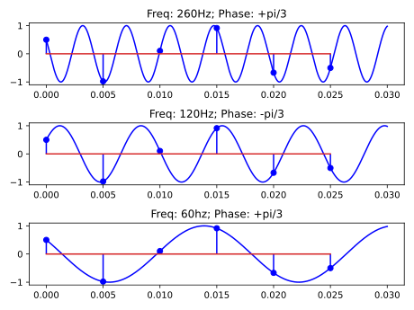
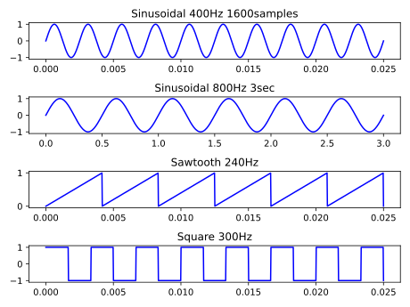
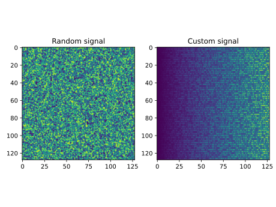

# Lab 1: Semnale continue si semnale discrete
# Ex 1

# Ex 2


# Ex 3
```
Avem fs = 2000Hz; T = 1/fs = 1/2000Hz =  0,0005s

1 esantion = 4 biti
2000 esantioane/secunda -> 2000 * 60 * 60 esantioane/ora -> 2000 * 60 * 60 * 4 biti
-> 2000 * 60 * 60 * 4 / 8 bytes = 3_600_000 bytes = 3.6Mb
```