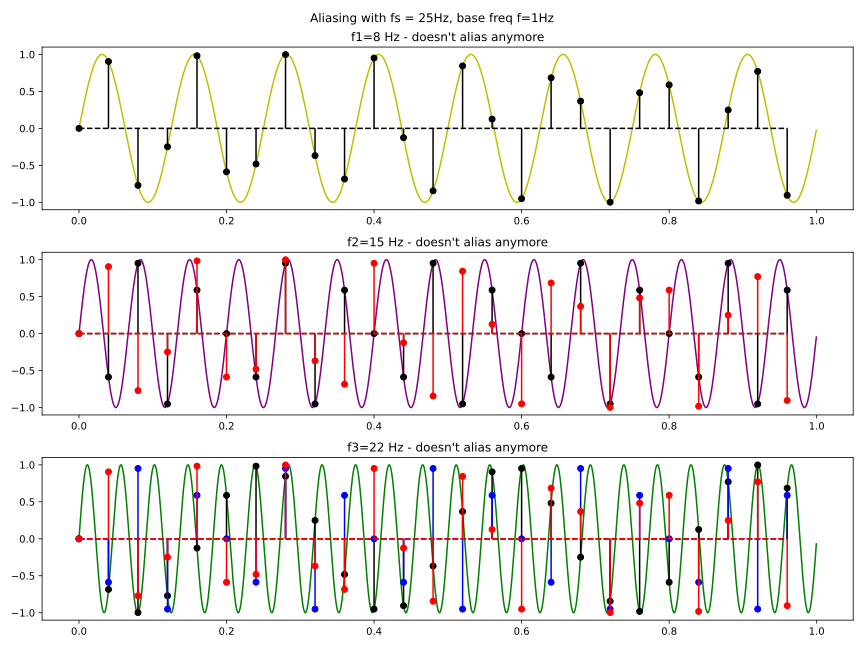
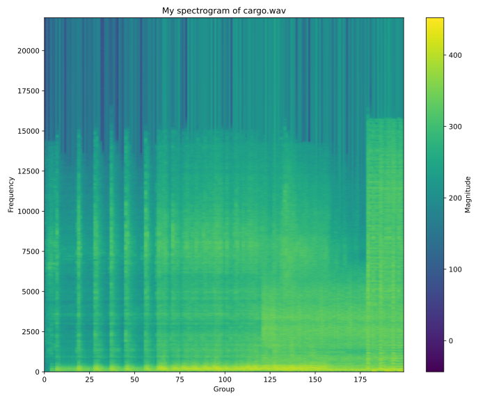
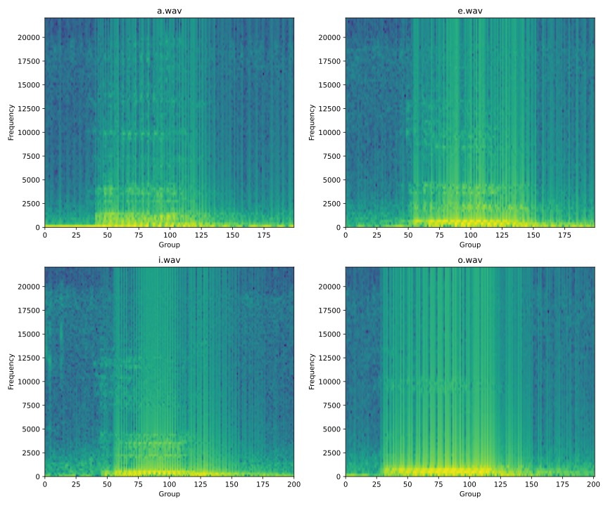

# Lab 4: Transformata Fourier - Partea II

# Ex 1
 

# Ex 2
 

# Ex 3


# Ex 4
Frecventele emise de un contrabas se ı̂ncadrează ı̂ntre 40Hz si 200Hz. Care
este frecventa minimă cu care trebuie esantionat semnalul trece-bandă
provenit din ı̂nregistrarea instrumentului, astfel ı̂ncât semnalul discretizat
să contină toate componentele de frecventă pe care instrumentul le poate
produce?

```
Cf Shanon-Nyquist, trebuie sa esantionam la fs > 2fmax 
fs > 2fmax => fs > 400Hz

```
# Ex 5
Fisierele audio cu vocalele inregistrate sunt:

```
audio/
├─ a.wav
├─ e.wav
├─ i.wav
├─ o.wav
└─ u.wav
```


# Ex 6
Spectrograma pentru a.wav:


Side by side:


# Ex 7
Puterea unui semnal este P_semnal = 90dB. Se cunoaste raportul semnal-
zgomot, SNR_db = 80dB. Care este puterea zgomotului?

```
P_semnal = 90dB
SNR_db = 80db
SNR_db = 10lg(SNR) => SNR = 10 ^ (SNR_db / 10)

SNR = P_semnal / P_zgomot => P_zgomot = P_semnal / (10 ^ (SNR_db / 10)) =
= 90 / (10 ^ 8) = 9  * 10^-7 dB

P_zgomot = 9  * 10^-7 dB
```