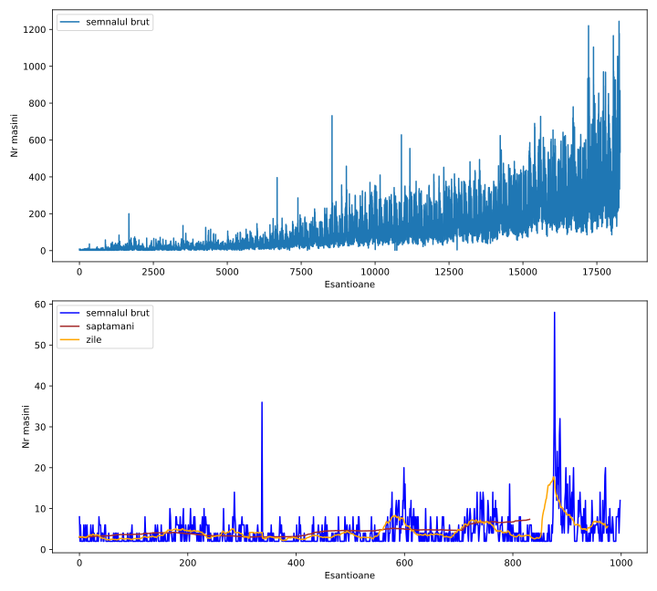
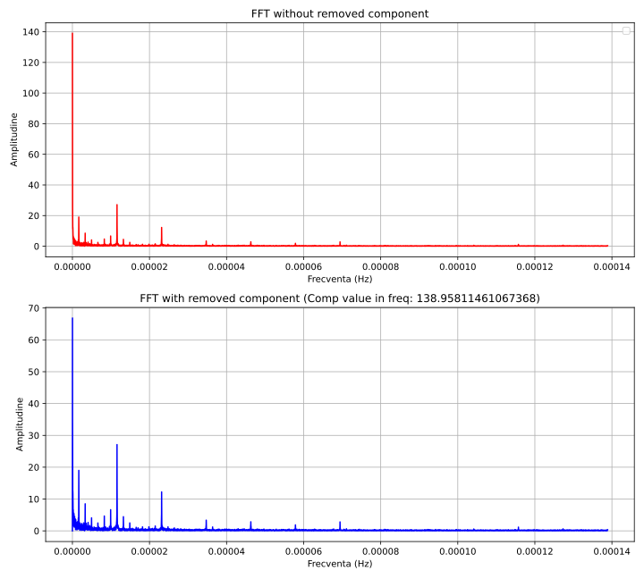
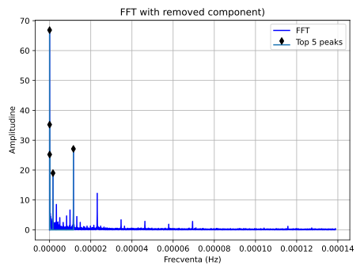
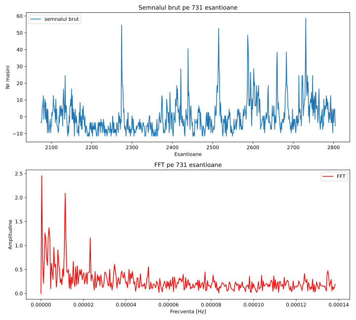
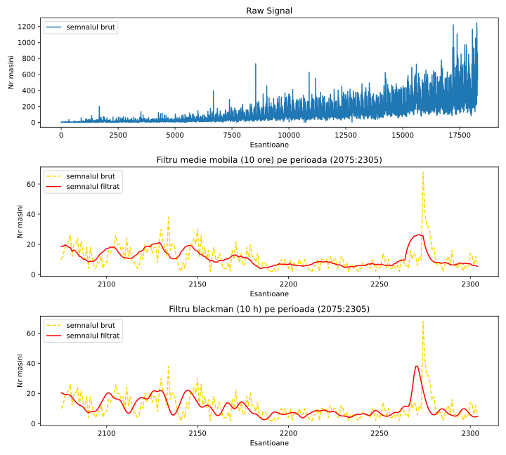

# Lab 5: Transformata Fourier - Partea III
# Ex 1
## Train.csv

## A
fs = 1/3600 = 0,000277778Hz

## B
delta = 18289h

## C
fs = 0,00027778Hz => fmax = fs/2 = 1/7200 = 0,000138889

## D si E
FFT pentru semnal: 

## F
Cele mai mari frecvente in semnal:

Cele mai mari frecvente sunt:  [1.51890736e-08 3.03781472e-08 1.15740741e-05 4.55672208e-08
 1.65560902e-06]

## G
Semnalul pe o luna, incepand de luni:

## I
Semnalul filtrat cu medie mobila si cu filtru Blackman.
