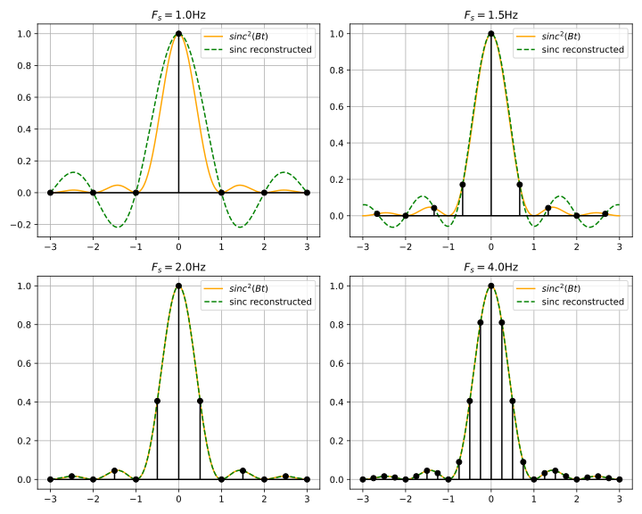
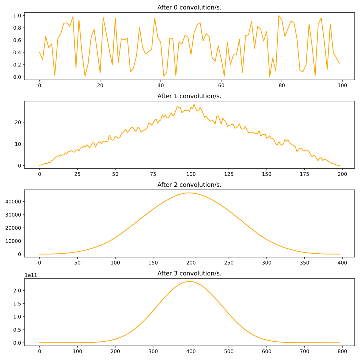
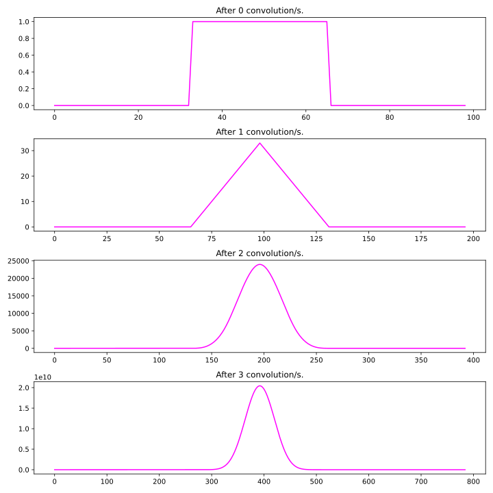
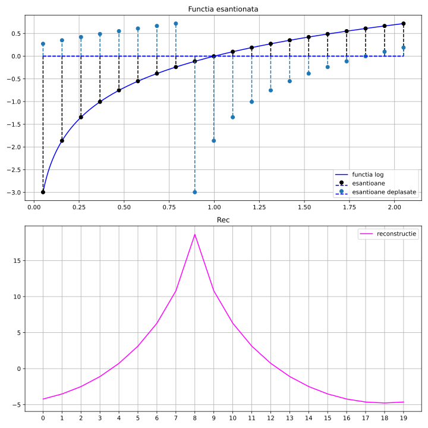
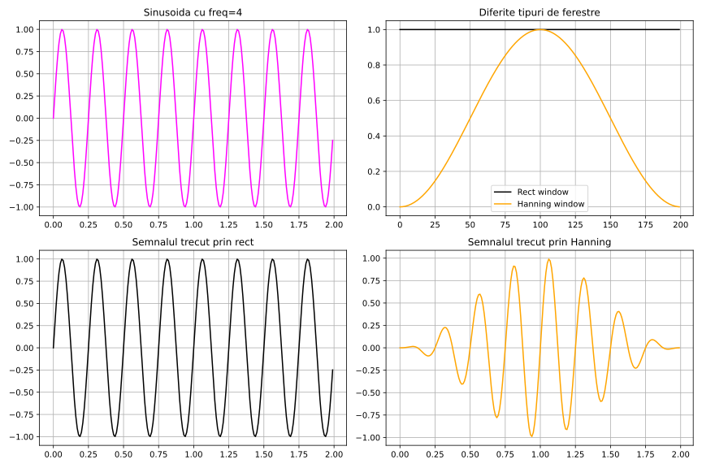
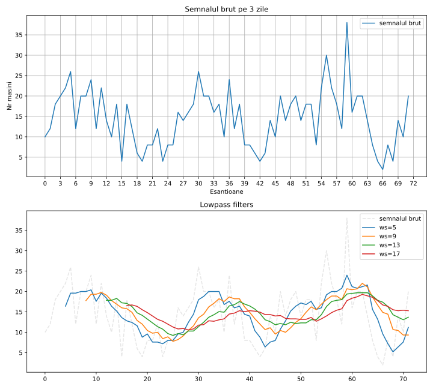
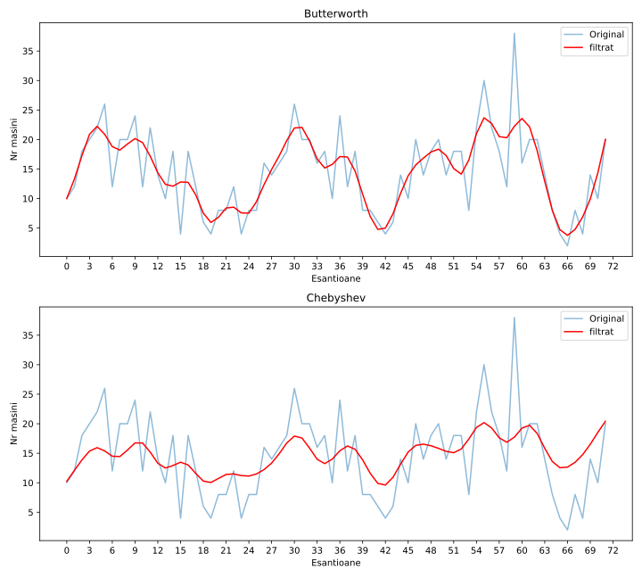

# Laboratorul 6: Convolutie. Filtre

# Ex 1

# Ex 2
Cu semnal random:

*Se aproximeaza curba gaussiana.*

Cu semnal rectangular:

*Convolutia a doua dreptunghiuri da un triunghi.*

# Ex 4

# Ex 5

# Ex 6

Frecventa Nyquist este jumatate din frecventa de esantionare: $ F_{N} = \frac{f_{s}}{2} $

Pentru semnalul din Train.csv, $f_{s} = 1/3600 = 2.78 \cdot 10^{-4} Hz$. (esantioanele sunt din ora in ora).

Aleg $f_{c} = \frac{f_{s}}{5}$, deci $f_{c} = 0.55 \cdot 10^{-4} Hz$

Frecventa normalizata la Nyquits va fi: $f_{n} = \frac{f_{c}}{f_{N}} = 0.39 Hz$

