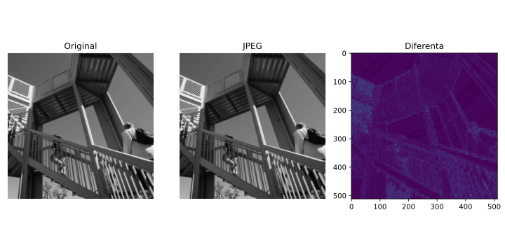
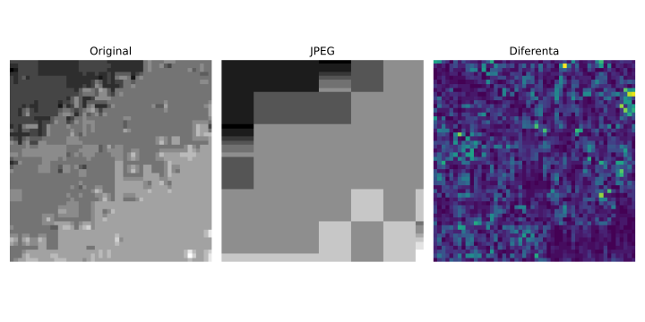
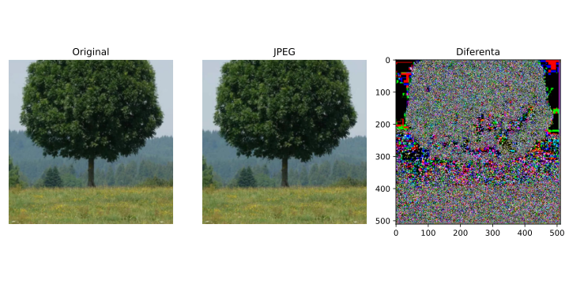
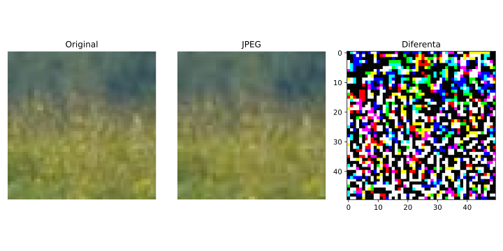
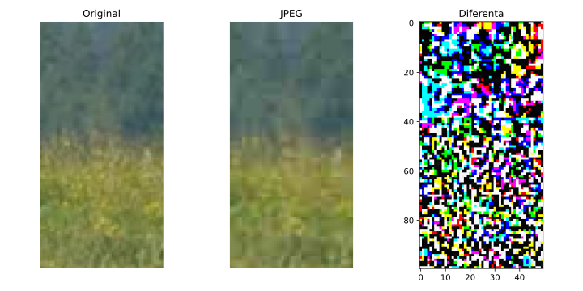

# Tema Codare JPEG

## 1. Codare JPEG pentru imagini grayscale



## 2. Codare JPEG pentru imagini color




## 3. Codare JPEG limitata de MSE
- Cautam binar numarul cu care inmultim matricea de cuantizare.
- Exemplu:
```bash
# Input
target = 55
```
```bash
# Output:
Scale factor:  1.3155960083007812
MSE: 55.00073
```


## 4. Codare JPEG pentru video
Fiecare frame din videoclip il codam JPEG.

## Rulare
Instalati dependentele:
```bash
python3 -m venv venv
source venv/bin/activate    
pip install --upgrade pip
pip install -r requirements.txt
```